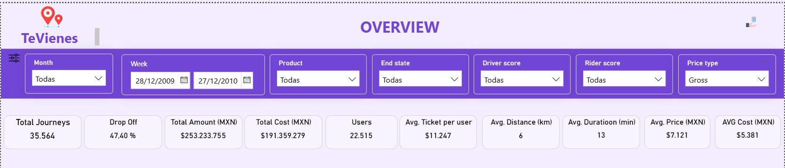
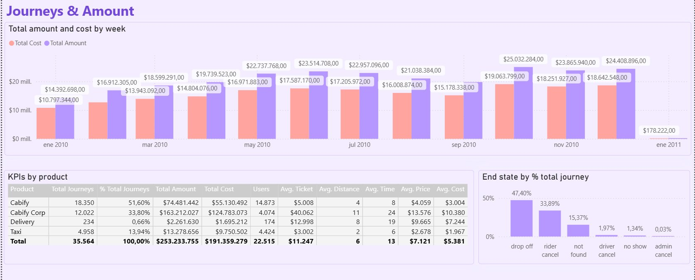
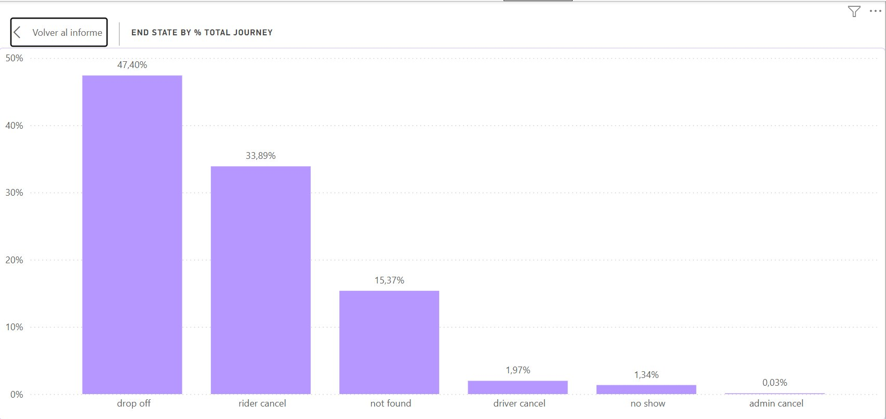
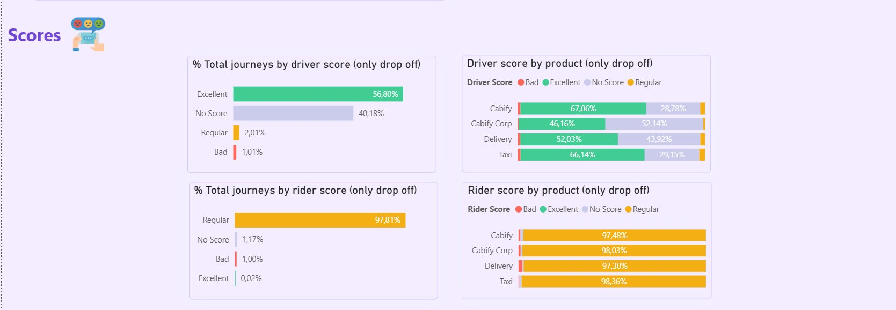

# Cabify — Operations Control Tower

**Role applied for:** Data Analyst / Business Intelligence Analyst  
**Company:** [Cabify](https://cabify.com) — Ride-hailing platform operating across Latin America and Spain  
**Deliverables:** Operations Control Tower dashboard (Power BI) + 3 Snowflake SQL queries  
**Dataset:** 35,564 journeys · Full year 2010 · Mexico City · Currency: MXN  
**Outcome:** Take-home data challenge as part of the selection process

---

## The Challenge

Cabify provided a real operations dataset (`Cabify_2010.xlsx`) containing ride-level data across four product lines — Cabify, Cabify Corp, Taxi, and Delivery — covering the full year 2010 in Mexico City. The dataset included 29 fields per journey: trip status, pricing, cost, distance, duration, product, platform, driver and rider scores, and discount applied.

The challenge had two components:

**1 — Operations Dashboard (Power BI)**  
Build an Operations Control Tower that gives leadership full visibility into trip performance, revenue, efficiency, and service quality — with filters for month, week, product, end state, driver score, rider score, and price type.

**2 — SQL Queries (Snowflake)**  
Write 3 production-ready analytical queries against a relational schema (`invoices`, `invoice_entries`, `journeys`):
- **Query 1:** Total discount per month, year, and currency for the last 4 calendar months
- **Query 2:** Total invoiced amount per city and country, excluding cities below MXN 1,500
- **Query 3:** Top 5 cities per country ranked by highest discount % relative to price

---

## Dashboard Screenshots

**Overview — KPI Headline Panel**  


**Journeys & Amount — Revenue and Cost by Week + KPIs by Product**  


**Trip Funnel — End State by % Total Journey**  


**Scores — Driver and Rider Quality by Product**  


---

## Key Numbers (Full Dataset — 35,564 Journeys)

### Journey Outcomes
| Status | Share |
|--------|-------|
| Completed (drop off) | **47.40%** |
| Rider cancelled | **33.89%** ⚠️ |
| Not found (no driver) | **15.37%** ⚠️ |
| Driver cancelled | 1.97% |
| No show | 1.34% |
| Admin cancel | 0.03% |

> **52.6% of all requests never complete a trip.** Rider cancellations alone — 1 in 3 requests — represent the single largest operations risk and the primary metric to attack.

### Revenue & Cost (Full Year 2010)
| Metric | Value |
|--------|-------|
| Total revenue | **MXN $253,233,755** |
| Total cost (driver payout) | MXN $191,359,279 |
| **Gross margin** | **~24.4%** |
| Avg ticket per user | MXN $11,247 |
| Avg price per trip | MXN $7,121 |
| Avg cost per trip | MXN $5,381 |
| Total users | 22,515 |

### Revenue by Product Line
| Product | Trips | Share | Total Revenue | Avg Ticket |
|---------|-------|-------|---------------|------------|
| Cabify | 18,350 | 51.6% | MXN $74,481,442 | MXN $5,008 |
| Cabify Corp | 12,022 | 33.8% | **MXN $163,212,027** | **MXN $40,062** |
| Taxi | 4,958 | 13.9% | MXN $13,278,656 | MXN $3,002 |
| Delivery | 234 | 0.66% | MXN $2,261,630 | MXN $12,998 |

> **Cabify Corp generates 64.5% of total revenue from only 33.8% of trips** — with an avg ticket 8x higher than standard Cabify. Protecting and growing the corporate segment is the single highest-leverage strategic priority.

### Trip Efficiency (Completed Trips)
| Metric | Value |
|--------|-------|
| Avg trip duration | **13 minutes** |
| Avg trip distance | **6 km** |

### Service Quality — Driver Scores (Completed Trips)
| Score | Share |
|-------|-------|
| Excellent | **56.80%** |
| No Score (unrated) | 40.18% ⚠️ |
| Regular | 2.01% |
| Bad | 1.01% |

> **40% of completed trips have no driver rating.** Reporting 56.8% Excellent without this caveat overstates quality confidence. The actual rated universe is only 60% of completed trips.

### Rider Score Breakdown
| Score | Share |
|-------|-------|
| Regular | **97.81%** |
| No Score | 1.17% |
| Bad | 1.00% |
| Excellent | 0.02% |

> Cabify Corp leads in rating consistency: 98.03% Regular rider score and 46.16% Excellent driver score — reflecting the higher service standard of the corporate segment.

---

## Dashboard Structure

### Page 1 — Overview
Global KPI panel with 7 interactive filters (Month, Week, Product, End State, Driver Score, Rider Score, Price Type):
- Total Journeys · Drop Off % · Total Amount · Total Cost
- Users · Avg Ticket per User · Avg Distance · Avg Duration · Avg Price · Avg Cost

### Page 2 — Journeys & Amount
- **Total Amount and Cost by Week** (clustered bar, full year 2010)
- **KPIs by Product** — full breakdown table: trips, %, revenue, cost, users, avg ticket, avg distance, avg time, avg price, avg cost
- **End State by % Total Journey** — bar chart drillthrough with click-through to full funnel view

### Page 3 — Trip Funnel (drillthrough)
Full-width bar chart: drop off (47.4%) → rider cancel (33.89%) → not found (15.37%) → driver cancel (1.97%) → no show (1.34%) → admin cancel (0.03%)

### Page 4 — Scores
- % Total journeys by driver score (bar)
- % Total journeys by rider score (bar)
- Driver score by product — stacked bar (Excellent / Regular / Bad / No Score)
- Rider score by product — stacked bar

---

## SQL Queries — Snowflake

All 3 queries use CTEs for readability and maintainability. Each CTE selects only the fields needed from the source table.

### Query 1 — Total Discount by Month, Year, and Currency (Last 4 Calendar Months)

```sql
/*
RDBMS: Snowflake
Query 1: Total discount per month, year and currency for the last 4 calendar months,
including the current one.

Notes:
- CTEs: cleaner, maintainable, referenceable multiple times within the same query.
- DATE_TRUNC: truncates to the first day of the month (e.g. 2024-11-09 → 2024-11-01).
- WHERE 1=1: simplifies adding/removing AND conditions during development.
*/

WITH BASE1 AS (
    SELECT
        invoice_id,
        currency,
        amount,
        created_at
    FROM invoices
),

BASE2 AS (
    SELECT
        invoice_entry_id,
        invoice_id,
        discount
    FROM invoice_entries
)

SELECT
    DATE_TRUNC('month', a.created_at::date)     AS month_year,
    YEAR(a.created_at::date)                    AS year,
    a.currency,
    SUM(b.discount)                             AS total_discount
FROM BASE1 a
LEFT JOIN BASE2 b ON a.invoice_id = b.invoice_id
WHERE 1=1
  AND a.created_at >= DATE_TRUNC('month', DATEADD('month', -3, CURRENT_DATE))
GROUP BY 1, 2, 3
ORDER BY year DESC, month_year DESC, a.currency;
```

### Query 2 — Total Invoiced Amount by City and Country (Threshold: ≥ 1,500)

```sql
/*
RDBMS: Snowflake
Query 2: Total invoiced amount per city and country.
Excludes cities with total invoiced amount below 1500.

Notes:
- HAVING total_amount >= 1500: aggregate-level filter (post GROUP BY).
- NULL handling: add WHERE country IS NOT NULL AND city IS NOT NULL
  if incomplete geographic records need to be excluded.
*/

WITH BASE1 AS (
    SELECT
        invoice_id,
        amount
    FROM invoices
),

BASE2 AS (
    SELECT
        invoice_id,
        journey_id
    FROM invoice_entries
),

BASE3 AS (
    SELECT
        journey_id,
        country,
        city
    FROM journeys
)

SELECT
    C.country,
    C.city,
    SUM(A.amount)   AS total_amount
FROM BASE1 A
LEFT JOIN BASE2 B ON A.invoice_id = B.invoice_id
LEFT JOIN BASE3 C ON B.journey_id = C.journey_id
GROUP BY 1, 2
HAVING total_amount >= 1500
ORDER BY C.country, C.city;
```

### Query 3 — Top 5 Cities by Highest Discount % per Country

```sql
/*
RDBMS: Snowflake
Query 3: For each country, the 5 cities with the highest discount %
relative to price.

Notes:
- DIV0: safe division — returns 0 when divisor is 0 (no error thrown).
- QUALIFY + ROW_NUMBER: filters window function results at SELECT level,
  avoiding a subquery wrapper. Clean Snowflake-native pattern.
*/

WITH BASE2 AS (
    SELECT
        invoice_entry_id,
        invoice_id,
        journey_id,
        price,
        discount
    FROM invoice_entries
),

BASE3 AS (
    SELECT
        journey_id,
        country,
        city
    FROM journeys
)

SELECT
    B.country,
    B.city,
    A.price,
    A.discount,
    DIV0(A.discount, A.price) * 100     AS perc_discount
FROM BASE2 A
LEFT JOIN BASE3 B ON A.journey_id = B.journey_id
QUALIFY
    ROW_NUMBER() OVER (PARTITION BY B.country ORDER BY perc_discount DESC) <= 5;
```

---

## Key Analytical Decisions

**Completion rate as the headline KPI, not revenue.** At 47.4%, less than half of all requests result in a completed trip. Revenue numbers only make sense once you understand the size of the demand leak upstream.

**Separated Cabify Corp from standard Cabify.** Aggregating all products hides the most critical business insight: Cabify Corp generates 64.5% of total revenue from 33.8% of trips, with an avg ticket 8x higher than consumer Cabify. Operations strategy for corporate accounts — supply allocation, SLAs, dedicated drivers — is fundamentally different.

**Flagged rating coverage as a data quality issue.** 56.8% Excellent driver score sounds strong until you notice 40% of completed trips have no score at all. The correct framing: 56.8% Excellent among the 60% of trips that were rated — not across all completed trips.

**Weekly revenue trend as the primary time dimension.** Monthly averages smooth out peaks. The weekly view of Total Amount vs. Total Cost reveals the seasonal demand pattern across 2010 and shows whether margin is consistent or variable throughout the year.

**Used QUALIFY + ROW_NUMBER in Query 3 instead of a subquery.** The Snowflake-native QUALIFY clause filters window function results cleanly at the SELECT level — same result as wrapping in a subquery, but more readable and maintainable.

---

## Actionable Insights for Operations Leadership

1. **Reduce rider cancellations (33.89% → target <20%).** This is the largest controllable leak. Root causes to investigate: ETA accuracy, driver proximity display, wait time expectations before confirmation.

2. **Fix "not found" rate (15.37%) with supply-demand matching by zone and hour.** 1 in 6 requests finds no available driver. Supply density mapping by time-of-day and city zone is the first diagnostic step.

3. **Protect Cabify Corp as the revenue core.** 64.5% of revenue from 33.8% of trips — any churn in the corporate segment has outsized P&L impact. Dedicated SLAs, priority supply allocation, and account-level dashboards are justified.

4. **Close the rating coverage gap.** 40% of trips unrated means quality monitoring is blind on 40% of the operation. A post-trip rating prompt (non-skippable before next booking) would close this within weeks.

5. **Audit discount allocation.** Formalize discount governance by segment: max % per product line, required approval threshold for high-value discounts, and tracking against campaign ROI.

---

## Tools & Stack

| Area | Tool |
|------|------|
| Dashboard | Power BI Desktop (DAX, Power Query, drillthrough pages, conditional formatting) |
| SQL | Snowflake (CTEs, DATE_TRUNC, DATEADD, QUALIFY, ROW_NUMBER, DIV0) |
| Data source | Excel (.xlsx) — 35,564 journey records, full year 2010 |

---

## About This Challenge

Take-home data challenge for a Data Analyst role at Cabify. The dataset covered Mexico City operations across Cabify, Cabify Corp, Taxi, and Delivery product lines for the full year 2010. The challenge tested end-to-end analytical thinking: raw data exploration, SQL query design for a multi-table schema, Power BI dashboard architecture, and business insight communication for a non-technical audience.

Documented here as part of my public BI & analytics portfolio.

---

## Connect

**Fredys Caballero** · Business Intelligence Analyst · Data Analyst  
[LinkedIn](https://linkedin.com/in/fcaballerosoto) · [GitHub Portfolio](https://github.com/fcaballerodata) · fredyscaballero@gmail.com
